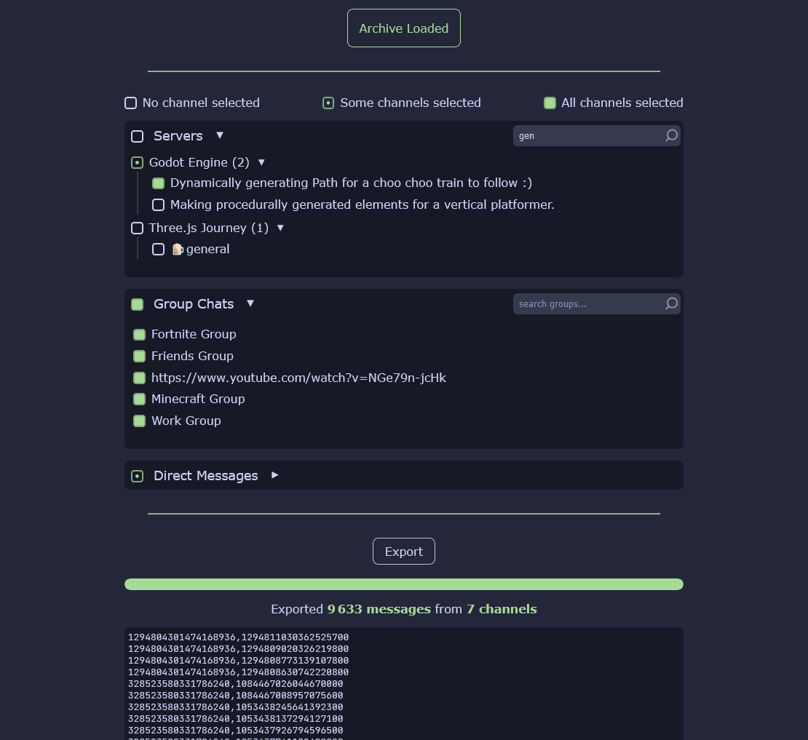

# Discord Package Exporter

Easily export desired channel and messages IDs from your Discord personal data package from your browser. 

> ⚠️ Nothing is sent anywhere, everything is done inside YOUR browser, your data stays on your computer and your computer only.

## 📰 You can use it without internet !

## 🤓 Features
- Export your data with correct format (.csv)
- Filter through channel names
- Read your messages

## 📷 Screenshots

## 🙏 Credits
- [zip.js](https://gildas-lormeau.github.io/zip.js/) - A JavaScript library to zip and unzip files by [Gildas Lormeau](https://github.com/gildas-lormeau)
- [catppuccin](https://catppuccin.com/) - 😸 Soothing pastel theme for the high-spirited!
- [json-with-bigint](https://github.com/Ivan-Korolenko/json-with-bigint) - Easily serialize and deserialize data with BigInt values 
